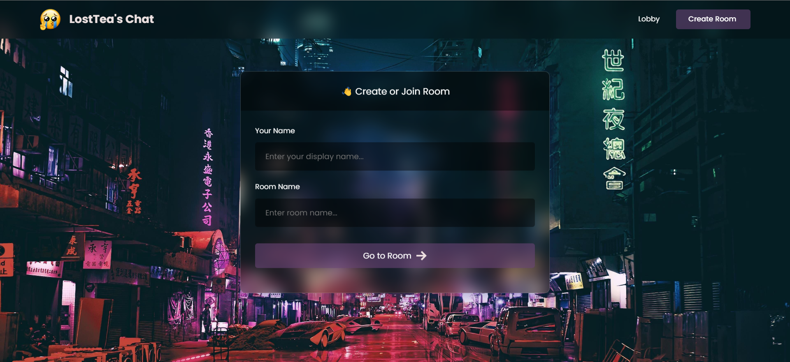

# LostTea Chats - P2P Web Streaming & Chatting App

LostTea Chats is a real-time, room-based group chatting application with P2P web streaming capabilities using Agora RTC. It enables users to communicate through video, audio, and text in a decentralized and secure manner.

## Features

- Create or join chat rooms with unique URLs.
- Real-time video and audio streaming using Agora RTC.
- Chat with emojis to express yourself creatively.
- Reply to previous messages for better conversation context.
- Send and receive images in chat.
- Visual indicator of who is speaking by calculating the intensity of the audio signal.

## Demo

You can try LostTea Chats live at [https://lostteachats.netlify.app](https://lostteachats.netlify.app).

## Contributing

We welcome contributions from the community. If you'd like to contribute to LostTea Chats, please follow our [contributing guidelines](CONTRIBUTING.md).

## Issues and Bug Reports

If you encounter any issues or want to report a bug, please use the [GitHub issue tracker](https://github.com/your-username/LostTea-Chats/issues) for this repository.

## License

This project is licensed under the MIT License - see the [LICENSE.md](LICENSE.md) file for details.

## Acknowledgments

- Thanks to the Agora RTC community for providing the technology that makes LostTea Chats possible.
- Special thanks to our contributors and supporters who have helped make this project better.

---

**Disclaimer:** LostTea Chats is an open-source project and not affiliated with any commercial or proprietary services. Use it responsibly and consider privacy and security implications when using P2P technologies.

Enjoy chatting with LostTea Chats!
